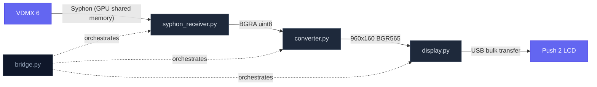
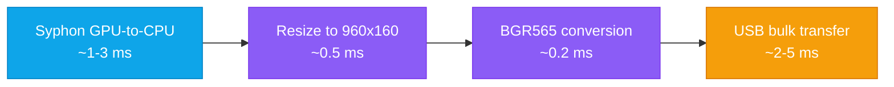
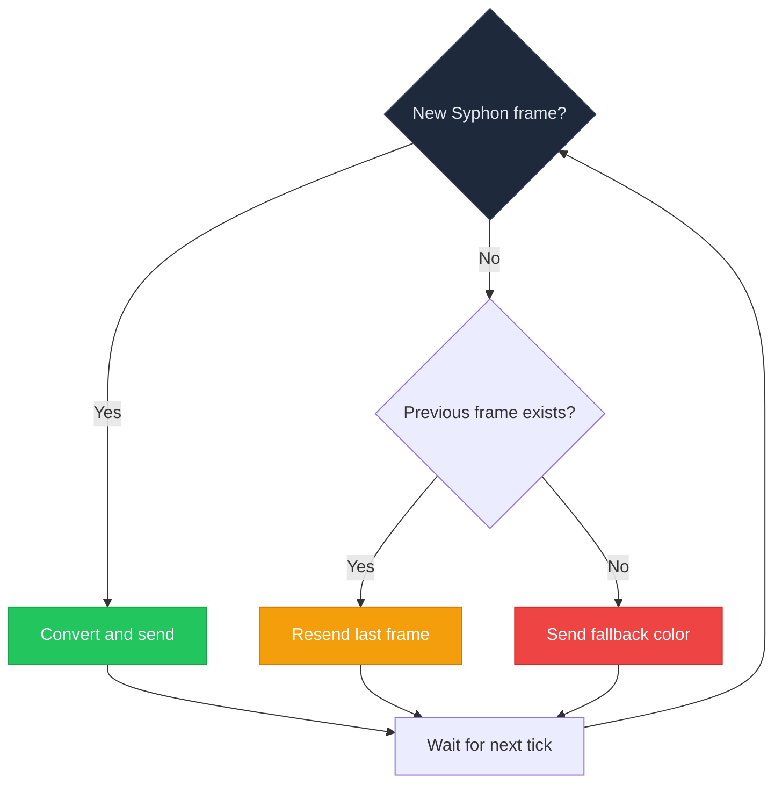

# push-2-led

[](https://www.python.org/downloads/)
[](https://www.apple.com/macos/)
[](LICENSE)
[](https://www.ableton.com/en/push/)

**Pipe live visuals from VDMX onto the Ableton Push 2's 960x160 LCD via Syphon.**

A Python bridge that receives GPU-shared frames from VDMX 6 over Syphon, converts them to the Push 2's native BGR565 format, and sends them over USB at 30+ fps. No drivers, no kernel extensions — just `brew install libusb` and go.

---

## Architecture



### Frame Pipeline



Total latency: **~5-10 ms per frame** at 30+ fps.

## Quick Start

### Prerequisites

- macOS 11+ (Big Sur or later)
- Python 3.9+
- [Homebrew](https://brew.sh)
- Ableton Push 2 connected via USB
- **Close Ableton Live** (only one app can access the display at a time)

### Install

```bash
brew install libusb

python3 -m venv .venv && source .venv/bin/activate
pip install -e .
```

### Run

```bash
push2-bridge
```

Or:

```bash
python -m push2_bridge
```

## VDMX Setup

1. Open **Workspace Inspector > Plugins > Syphon Output**
2. Create a Syphon server named **`Push2`**
3. Set the output resolution to **960x160** for pixel-perfect mapping

The bridge auto-discovers a Syphon server named "Push2" by default. Designing content at native resolution avoids resize overhead and gives you full control over composition in VDMX.

> **Tip:** The 6:1 ultrawide aspect ratio works great for waveforms, spectral visualizers, text crawls, horizontal meters, and abstract patterns.

## CLI Options

```
push2-bridge [OPTIONS]

Options:
  --fps N                Target frame rate (default: 30)
  --syphon-server NAME   Syphon server name to connect to (default: Push2)
  --fallback-color R,G,B Fallback color when no frame available (default: 0,0,0)
  --interpolation MODE   Resize method: linear or nearest (default: linear)
  -v, --verbose          Enable debug logging
  --version              Show version
  --help                 Show help
```

### Examples

```bash
# Run at 60 fps with verbose logging
push2-bridge --fps 60 -v

# Connect to a specific Syphon server
push2-bridge --syphon-server "My VDMX Output"

# Blue fallback screen when no Syphon signal
push2-bridge --fallback-color 0,0,255

# Nearest-neighbor interpolation (sharper pixels, no smoothing)
push2-bridge --interpolation nearest
```

## Modules

```
src/push2_bridge/
    __init__.py          # Package version
    __main__.py          # python -m entry point
    cli.py               # CLI argument parsing
    bridge.py            # Main loop: receive -> convert -> send
    syphon_receiver.py   # Syphon client with auto-discovery
    converter.py         # Resize + BGRA -> BGR565 conversion
    display.py           # Push 2 USB display driver

scripts/
    benchmark.py         # Frame conversion benchmarking

tests/
    test_bridge.py
    test_cli.py
    test_converter.py
    test_syphon_receiver.py
```

## How It Works

### Display Protocol

The Push 2 LCD is driven via USB bulk transfers following [Ableton's published spec](https://github.com/Ableton/push-interface):

| Parameter | Value |
|-----------|-------|
| USB VID/PID | `0x2982` / `0x1967` |
| Interface | 0 |
| Endpoint | `0x01` (bulk OUT) |
| Resolution | 960 x 160 |
| Pixel format | BGR565 (16-bit) |
| Line stride | 2048 bytes |
| Frame header | `FF CC AA 88` + 12x `00` |
| Pixel data | 327,680 bytes |
| XOR mask | `E7 F3 E7 FF` (repeating) |
| Display timeout | 2 seconds |

### Keep-Alive

The display blacks out after 2 seconds without a frame. The bridge handles this automatically:



### Error Recovery

- **Push 2 unplugged mid-stream** — catches USB errors, attempts reconnection
- **VDMX closed / Syphon server drops** — auto-rediscovers on each frame tick
- **Ctrl+C** — clean shutdown, releases USB interface

## Development

```bash
python3 -m venv .venv && source .venv/bin/activate
pip install -e ".[dev]"

# Run tests
pytest

# Run benchmark
python scripts/benchmark.py

# Lint
ruff check src/ tests/
```

## Performance

| Format | FPS | Notes |
|--------|-----|-------|
| BGR565 (native) | ~36 fps | Direct 16-bit path, no internal conversion |
| RGB565 | ~14 fps | Library converts internally |
| RGB float | ~14 fps | Slowest — float64 intermediary |

The bridge uses the BGR565 native path by default for maximum throughput.

## Credits

Built with:
- [push2-python](https://github.com/ffont/push2-python) — Push 2 USB display driver
- [syphon-python](https://github.com/njsmith/syphon-python) — Syphon client for macOS
- [OpenCV](https://opencv.org/) — Frame resizing
- [Ableton Push Interface Spec](https://github.com/Ableton/push-interface) — Official display protocol docs

## Support

If this project saved you some time or sparked an idea, consider buying me a coffee:

[](https://ko-fi.com/joaodotwork)

---

Made for VJs who want another screen.
